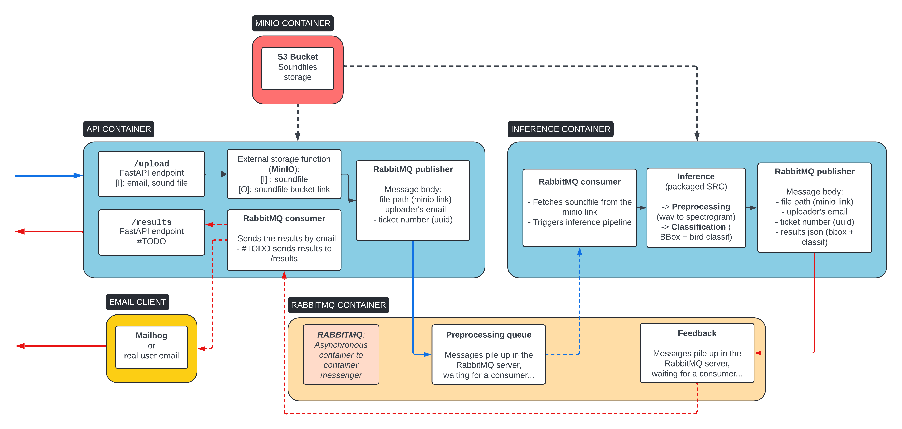

___
# **Bird Sound Classification: API Integration**
___
#TODO add a brief description




## **Table of Contents**

- [Introduction](#introduction)
- [Features](#features)
- [Installation](#installation)
- [Usage](#usage)
- [Contributing](#contributing)
- [License](#license)


## **Introduction**

Allows users to upload WAV files containing bird sounds and receive classification results via email. 
Consists of two main services: an API service for handling user requests and an inference service for performing the actual classification.

## **Features**

- API Service: Handles user requests, sends WAV files to the inference service via RabbitMQ, and sends email notifications to users.
- Inference Service: Receives WAV files from the API service, performs bird sound classification using a pre-trained model, and sends the results back to the API service via RabbitMQ.
- RabbitMQ: Enables asynchronous communication between the API and inference services.
- MinIO: Provides lightweight file storage for WAV files and classification results.
- Mailhog: Facilitates email testing during development.


## **Installation**

### Clone repository
```bash
git clone https://github.com/ValBaron10/BirdSoundClassif.git
cd BirdSoundClassif
```

### Build Docker images
- Using the `Makefile`:
```bash
make build-all
```

- Running the build scripts manually:
```bash
cd docker/base
./build.sh

cd ../inference # /docker/inference
./build.sh

cd ../api # /docker/api
./build.sh

# Back to repository root
cd ../..
```

- Optional: push built images into your dockerhub repository `bird-sound-classif` (repo must be created beforehand)
```bash
make push-all DOCKER_ACCOUNT=yourdockerhubaccount
```

### Configure secret variables

Rename `.env.example` file into `.env` to make secrets available to the docker compose service


## **Usage**

### Launch services

```bash
docker compose up
# Or
make run-all
```
Let this terminal process run and watch for logs in case of dysfunctionments
Open a new terminal to run the next commands

### Launch upload functions

#### `/upload-dev`
- From the browser: Go to `localhost:8001/docs`, click on `upload-dev` endpoint and give an email address
- From the `Makefile`: in the terminal, type `make upload-dev`
- From a `curl` command: in the terminal, type:
```bash
curl -X 'GET' \
  'http://localhost:8001/upload-dev?email=user%40example.com' \
  -H 'accept: application/json'
```

#### `/upload` #TODO
- From the browser: Go to `localhost:8001/docs`, click on `upload-dev` endpoint, select the file to upload and give an email address
- From the terminal:
```bash
curl -X 'POST' \
  'http://localhost:8001/upload-dev?email=user%40example.com' \
  #TODO \
  -H 'accept: application/json'
```

Congratulations! Your request is making a round trip inside the service, let's see what happens...

### Access service UIs

#### S3 Storage
When the upload arrives, the wav files is stored in an S3 bucket

- In your browser, go to `localhost:9001`, default user / password are `miniouser` / `miniouser123`
  - Change these values in the `.env` file if needed  

- Click on the `mediae` folder, find the `wav` file and the `json` file containing the results!   


#### Mailhog (developper mail client) 
When the api container gets the feedback messgae from the inference container, it sends an email to the user's email address

- In your browser, go to `localhost:8025`
- Click on the new message to see the mail body
- Click on the `MIME` tab an click on the `download` `application/json` button to download the classification results `json` attachement! 


#### RabbitMQ Management 
A web-based interface for monitoring and managing RabbitMQ message queues and their traffic.

- In your browser, go to `localhost:15672`
- Go to the `Queues` tab: find info about message traffic for both forwarding and feedback queues
- You can inspect the message bodies with the button `Get Message(s)`


### Shutdown / teardown services
Shutdown
```bash
docker compose down
# Or
make shutdown
```

Teardown (caution volumes are destroyed, use in dev mode only)
```bash
docker compose down -v
# Or
make teardown
```

## **Example of healthy logs**

Api container startup
```bash
...
api-1        | INFO:pika.adapters.blocking_connection:Created channel=1
api-1        | INFO:root:Declaring queue: api_to_inference
api-1        | INFO:root:Declaring queue: inference_to_api
api-1        | INFO:     Started server process [11]
api-1        | INFO:     Waiting for application startup.
api-1        | INFO:     Application startup complete.

```
Inference container startup
```bash
inference-1  | INFO:root:RabbitMQ connection established.
inference-1  | INFO:pika.adapters.blocking_connection:Created channel=1
inference-1  | INFO:root:Declaring queue: inference_to_api
inference-1  | INFO:__main__:Waiting for messages from queue: api_to_inference
```

Upload -> inference pipeline
```bash
...
api-1        | INFO:root:File 'Turdus_merlula.wav' written to MinIO bucket 'mediae' successfully.
...
api-1        | INFO:root:Published message: {'minio_path': 'mediae/Turdus_merlula.wav', 'email': 'user@example.com', 'ticket_number': 'c0ea90'}
api-1        | INFO:     172.24.0.1:34770 - "GET /upload-dev?email=user%40example.com HTTP/1.1" 200 OK
inference-1  | INFO:__main__:Received message from RabbitMQ: MinIO path=mediae/Turdus_merlula.wav, Email=user@example.com, Ticket number=c0ea90
inference-1  | INFO:__main__:WAV file downloaded from MinIO: Turdus_merlula.wav
inference-1  | INFO:model_serve.model_serve:Weights path: {self.weights_path}
inference-1  | INFO:model_serve.model_serve:Reversed birds dict: {self.reverse_bird_dict}
inference-1  | INFO:model_serve.model_serve:Loading model...
inference-1  | INFO:model_serve.model_serve:Model loaded successfully
inference-1  | INFO:model_serve.model_serve:Starting run_detection on Turdus_merlula.wav...
100%|██████████| 1/1 [00:00<00:00,  2.15it/s]
inference-1  | INFO:model_serve.model_serve:[fp]: 
inference-1  | <src.features.prepare_dataset.File_Processor object at 0x7385bc1dfe20>
inference-1  | 
inference-1  | 
inference-1  | INFO:model_serve.model_serve:[output]: 
inference-1  | {'Turdus merula': {'bbox_coord': [[552, 182, 629, 258]], 'scores': [0.9958606362342834]}}
...
inference-1  | INFO:root:File 'Turdus_merlula.json' written to MinIO bucket 'mediae' successfully.
inference-1  | INFO:root:Preparing to publish message to queue: inference_to_api
inference-1  | INFO:root:Published message: {'wav_minio_path': 'mediae/Turdus_merlula.wav', 'json_minio_path': 'Turdus_merlula.json', 'email': 'user@example.com', 'ticket_number': 'c0ea90'}
api-1        | INFO:root:Fetching file 'Turdus_merlula.json' from MinIO bucket 'mediae'...
api-1        | INFO:root:File 'Turdus_merlula.json' fetched from MinIO bucket 'mediae' and saved to '/tmp/tmpukc2ftj7' successfully.
...
api-1        | 
api-1        | Email sent successfully to user@example.com for ticket #0f08f8
api-1        | 
```

--------
## **PREVIOUS CHECKPOINTS**  
___


### Remarques

#### Structure des dossiers
- Les différents services ont chacun leur sous-dossier dans `app/`:
  - `inference/`
  -  `api/`
  -  ...
- Les sous dossiers de `docker/` reprennent cette même structure


#### Le dossier docker
- L'image **base** sert de base d'image pour construire les autres, elle comprend python et notre package custom **src**
- Les autres images ont chacune leur propre jeu de dépendances (`requirements.txt`) pour éviter des images inutilement lourdes:
  - **Api**: fastapi, requests etc
  - **Inference**: torch, ffmpeg, librosa etc
- Dans chaque dossier d'image, un script `build.sh` permet de construire l'image en allant chercher le contenu correspondant dans `app/`
- Le tag des images reprend mes identifiants Dockerhub: `username/repo_name:local_folder_name`, remplacer ce tag par vos propres identifiants dans les fichiers `build.sh` si nécessaire
- Si vous voulez pull un image sur dockerhub, les scripts `pull.sh` doivent être modifiés du coup


### Installation

```bash
cd docker/base
./build.sh

cd docker/inference
./build.sh

```

### Lancement du container
Lancement du container en mode bash

```bash
# Si necessaire:
cd docker/inference

# Puis:
./start_bash.sh

```

Dans le container:
```bash
python inference/main.py


#===================
# Commandes de debug
# Check des libraries python:
pip freeze | cat


```


### 2ème essai, l'inférence tourne correctement
Modifs nécessaires pour le cpu:
- Ajout d'une fonction `load_weights_cpu()` dans `src/models/detr`
- Ajout d'un script spécifique au cpu `run_detection_cpu.py`

```bash
root@0a0df020b2e4:/app# python inference/main.py 
...
2024-05-08 10:28:03,038 - INFO - [output]: 
{'Turdus merula': {'bbox_coord': [[552, 182, 629, 258]], 'scores': [0.9958606362342834]}}
```


### Après un premier essai...
On retourne au bon vieux message d'erreur dû aux problèmes de cpu... 
Il semble que l'on doit repackager un 2ème `src` avec certaines parties du code réécrites pour le cpu

```bash
root@2ca153072c27:/app# python inference/main.py 
Traceback (most recent call last):
  File "/app/inference/main.py", line 10, in <module>
    model, config = load_model(mod_p)
  File "/app/src/models/run_detection.py", line 84, in load_model
    model = load_weights(config, model, path=os.path.join(mod_p, 'model_chkpt_last.pt'), train=False).to(config.device)
  File "/app/src/models/detr.py", line 355, in load_weights
    state_dict = torch.load(path)
  File "/usr/local/lib/python3.10/dist-packages/torch/serialization.py", line 1026, in load
    return _load(opened_zipfile,
  File "/usr/local/lib/python3.10/dist-packages/torch/serialization.py", line 1438, in _load
    result = unpickler.load()
  File "/usr/local/lib/python3.10/dist-packages/torch/serialization.py", line 1408, in persistent_load
    typed_storage = load_tensor(dtype, nbytes, key, _maybe_decode_ascii(location))
  File "/usr/local/lib/python3.10/dist-packages/torch/serialization.py", line 1382, in load_tensor
    wrap_storage=restore_location(storage, location),
  File "/usr/local/lib/python3.10/dist-packages/torch/serialization.py", line 391, in default_restore_location
    result = fn(storage, location)
  File "/usr/local/lib/python3.10/dist-packages/torch/serialization.py", line 266, in _cuda_deserialize
    device = validate_cuda_device(location)
  File "/usr/local/lib/python3.10/dist-packages/torch/serialization.py", line 250, in validate_cuda_device
    raise RuntimeError('Attempting to deserialize object on a CUDA '
RuntimeError: Attempting to deserialize object on a CUDA device but torch.cuda.is_available() is False. If you are running on a CPU-only machine, please use torch.load with map_location=torch.device('cpu') to map your storages to the CPU.
```


