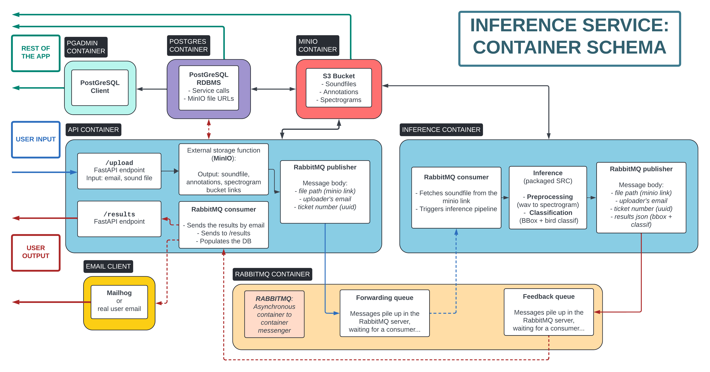

___
# **Bird Sound Classification: API Integration**
___
#TODO add a brief description  




## **Table of Contents**

- [Introduction](#introduction)
- [Features](#features)
- [Installation](#installation)
- [Usage](#usage)
- [Example of healthy logs](#example-of-healthy-logs)


## **Introduction**

Allows users to upload WAV files containing bird sounds and receive classification results via email.
Consists of two main services: an API service for handling user requests and an inference service for performing the actual classification.

## **Features**

- API Service: Handles user requests, sends WAV files to the inference service via RabbitMQ, and sends email notifications to users.
- Inference Service: Receives WAV files from the API service, performs bird sound classification using a pre-trained model, and sends the results back to the API service via RabbitMQ.
- RabbitMQ: Enables asynchronous communication between the API and inference services.
- MinIO: Provides lightweight file storage for WAV files and classification results.
- Mailhog: Facilitates email testing during development.
- PostgreSQL: Stores metadata about the service calls and classification results.
- PgAdmin: Provides a web-based interface for managing the PostgreSQL database.


## **Installation**

### Clone repository
```bash
git clone https://github.com/ValBaron10/BirdSoundClassif.git
cd BirdSoundClassif
```

### Build Docker images
- Using the `Makefile`:
```bash
# WITH DEFAULT IMAGE TAG
make build-all

# TAGGING IMAGES WITH YOUR OWN DOCKERHUB ACCOUNT:
make build-all DOCKER_ACCOUNT=yourusername

```

- Running the build scripts manually:
```bash
# BUILDING IMAGES WITH DEFAULT TAG
cd docker/base
./build.sh matthieujln

cd ../inference # /docker/inference
./build.sh matthieujln

cd ../api # /docker/api
./build.sh matthieujln

# Back to repository root
cd ../..
```

- Optional: push built images into your dockerhub repository `bird-sound-classif` (repo must be created beforehand)
```bash
make push-all DOCKER_ACCOUNT=yourdockerhubaccount
```

### Configure environment variables and secrets

Rename `.env.example` file into `.env` to make secrets available to the docker compose service

All environment variables are listed at the top of the `docker-compose.yml` under this section:
```yaml
x-common-env: &common-env
  environment:
  ...
```

They are linked to each container with this:
```yaml
    <<: *common-env
```

## **Usage**

**Api runs on port `8001`**

### Launch services

```bash
docker compose up

# OR
make run-all

# OR USING YOUR OWN IMAGE TAGS:
make run-all DOCKER_ACCOUNT=yourusername

```
Let this terminal process run and watch for logs in case of dysfunctionments
Open a new terminal to run the next commands

### Call REST Api upload functions

#### GET `/upload-dev`
A function that relies on a built-in wav file instead of a real upload.
- From the browser: Go to `localhost:8001/docs`, click on `upload-dev` endpoint and give an email address
- Using the `Makefile`:
```bash
make upload-dev
```
- From a `curl` command: in the terminal, type:
```bash
curl -X 'GET' \
  'http://localhost:8001/upload-dev?email=user%40example.com' \
  -H 'accept: application/json'
```

#### POST `/upload`
A function receiving a wav file from the user.
- From the browser: Go to `localhost:8001/docs`, select on `upload` endpoint, select the file to upload and give an email address
- From the terminal:
```bash
# REPLACE `merle1` WITH YOUR OWN WAV FILE
curl -X 'POST' \
  'http://localhost:8001/upload' \
  -H 'accept: application/json' \
  -H 'Content-Type: multipart/form-data' \
  -F 'file=@merle1.wav;type=audio/wav' \
  -F 'email=user@example.com'

#TODO explain how does the `@` get to point to a local file in a curl command
```

Congratulations! Your request is making a round trip inside the service, let's see what happens...

### Access service UIs

#### S3 Storage
When the upload arrives, the wav file is stored in an S3 bucket

- In your browser, go to `localhost:9001`, default user / password are `miniouser` / `miniouser123`
  - Change these values in the `.env` file if needed  

- Click on the `mediae` folder, find the `wav` file and the `json` file containing the results!  


#### Mailhog (developer mail client)
When the api container gets the feedback messgae from the inference container, it sends an email to the user's email address

- In your browser, go to `localhost:8025`
- Click on the new message to see the mail body
- Click on the `MIME` tab an click on the `download` `application/json` button to download the classification results `json` attachement!  


#### RabbitMQ Management
A web-based interface for monitoring and managing RabbitMQ message queues and their traffic.

- In your browser, go to `localhost:15672`
- Go to the `Queues` tab: find info about message traffic for both forwarding and feedback queues
- You can inspect the message bodies with the button `Get Message(s)`

### PgAdmin

A web-based interface for managing the PostgreSQL database.

- In your browser, go to `localhost:5051`
- Default user / password are `admin@example.com` / `password`
- Change these values in the `.env` file if needed
- Instructions to connect:
     
  


### Shutdown / teardown services
Shutdown
```bash
docker compose down
# OR
make shutdown
```

Teardown (caution: storage volumes are deleted, use in dev mode only)
```bash
docker compose down -v
# OR
make teardown
```

## **Example of healthy logs**

Api container startup
```css
...
api-1        | INFO:     Started server process [10]
api-1        | INFO:     Waiting for application startup.
api-1        | INFO:root:Initializing MinIO client...
api-1        | INFO:root:Checking if bucket exists...
api-1        | INFO:root:Checking if bucket 'mediae' exists...
api-1        | INFO:root:Bucket 'mediae' already exists.
api-1        | INFO:root:Connecting to RabbitMQ...
api-1        | INFO:root:Checking RabbitMQ connection
api-1        | INFO:root:RabbitMQ connection is None or closed. Establishing a new connection.
api-1        | INFO:root:Attempting to connect to RabbitMQ (Attempt 1/5)
api-1        | INFO:pika.adapters.utils.connection_workflow:Pika version 1.3.1 connecting to ('172.28.0.2', 5672)
api-1        | INFO:pika.adapters.utils.io_services_utils:Socket connected: <socket.socket fd=15, family=AddressFamily.AF_INET, type=SocketKind.SOCK_STREAM, proto=6, laddr=('172.28.0.7', 33174), raddr=('172.28.0.2', 5672)>
api-1        | INFO:pika.adapters.utils.connection_workflow:Streaming transport linked up: (<pika.adapters.utils.io_services_utils._AsyncPlaintextTransport object at 0x720a170b02b0>, _StreamingProtocolShim: <SelectConnection PROTOCOL transport=<pika.adapters.utils.io_services_utils._AsyncPlaintextTransport object at 0x720a170b02b0> params=<ConnectionParameters host=rabbitmq port=5672 virtual_host=/ ssl=False>>).
api-1        | INFO:pika.adapters.utils.connection_workflow:AMQPConnector - reporting success: <SelectConnection OPEN transport=<pika.adapters.utils.io_services_utils._AsyncPlaintextTransport object at 0x720a170b02b0> params=<ConnectionParameters host=rabbitmq port=5672 virtual_host=/ ssl=False>>
api-1        | INFO:pika.adapters.utils.connection_workflow:AMQPConnectionWorkflow - reporting success: <SelectConnection OPEN transport=<pika.adapters.utils.io_services_utils._AsyncPlaintextTransport object at 0x720a170b02b0> params=<ConnectionParameters host=rabbitmq port=5672 virtual_host=/ ssl=False>>
api-1        | INFO:pika.adapters.blocking_connection:Connection workflow succeeded: <SelectConnection OPEN transport=<pika.adapters.utils.io_services_utils._AsyncPlaintextTransport object at 0x720a170b02b0> params=<ConnectionParameters host=rabbitmq port=5672 virtual_host=/ ssl=False>>
api-1        | INFO:root:Successfully connected to RabbitMQ
api-1        | INFO:root:RabbitMQ connection established.
api-1        | INFO:pika.adapters.blocking_connection:Created channel=1
api-1        | INFO:root:Declaring queue: api_to_inference
api-1        | INFO:root:Declaring queue: inference_to_api
api-1        | INFO:     Application startup complete.

```
Inference container startup
```css
inference-1  | INFO:matplotlib.font_manager:generated new fontManager
inference-1  | INFO:root:Checking RabbitMQ connection
inference-1  | INFO:root:RabbitMQ connection is None or closed. Establishing a new connection.
inference-1  | INFO:root:Attempting to connect to RabbitMQ (Attempt 1/5)
inference-1  | INFO:pika.adapters.utils.connection_workflow:Pika version 1.3.1 connecting to ('172.28.0.2', 5672)
inference-1  | INFO:pika.adapters.utils.io_services_utils:Socket connected: <socket.socket fd=6, family=AddressFamily.AF_INET, type=SocketKind.SOCK_STREAM, proto=6, laddr=('172.28.0.8', 59106), raddr=('172.28.0.2', 5672)>
inference-1  | INFO:pika.adapters.utils.connection_workflow:Streaming transport linked up: (<pika.adapters.utils.io_services_utils._AsyncPlaintextTransport object at 0x71604d202860>, _StreamingProtocolShim: <SelectConnection PROTOCOL transport=<pika.adapters.utils.io_services_utils._AsyncPlaintextTransport object at 0x71604d202860> params=<ConnectionParameters host=rabbitmq port=5672 virtual_host=/ ssl=False>>).
inference-1  | INFO:pika.adapters.utils.connection_workflow:AMQPConnector - reporting success: <SelectConnection OPEN transport=<pika.adapters.utils.io_services_utils._AsyncPlaintextTransport object at 0x71604d202860> params=<ConnectionParameters host=rabbitmq port=5672 virtual_host=/ ssl=False>>
inference-1  | INFO:pika.adapters.utils.connection_workflow:AMQPConnectionWorkflow - reporting success: <SelectConnection OPEN transport=<pika.adapters.utils.io_services_utils._AsyncPlaintextTransport object at 0x71604d202860> params=<ConnectionParameters host=rabbitmq port=5672 virtual_host=/ ssl=False>>
inference-1  | INFO:pika.adapters.blocking_connection:Connection workflow succeeded: <SelectConnection OPEN transport=<pika.adapters.utils.io_services_utils._AsyncPlaintextTransport object at 0x71604d202860> params=<ConnectionParameters host=rabbitmq port=5672 virtual_host=/ ssl=False>>
inference-1  | INFO:root:Successfully connected to RabbitMQ
inference-1  | INFO:root:RabbitMQ connection established.
inference-1  | INFO:pika.adapters.blocking_connection:Created channel=1
inference-1  | INFO:root:Declaring queue: inference_to_api
inference-1  | INFO:__main__:Waiting for messages from queue: api_to_inference
```

Upload -> inference pipeline -> email
```css
api-1        | ERROR:root:File audio/20240621124851231798_merle1.wav does not exist in MinIO. Uploading... Error: S3 operation failed; code: NoSuchKey, message: Object does not exist, resource: /mediae/audio/20240621124851231798_merle1.wav, request_id: 17DB05DD663787EB, host_id: dd9025bab4ad464b049177c95eb6ebf374d3b3fd1af9251148b658df7ac2e3e8, bucket_name: mediae, object_name: audio/20240621124851231798_merle1.wav
api-1        | INFO:root:Writing file 'audio/20240621124851231798_merle1.wav' to MinIO bucket 'mediae'...
api-1        | INFO:root:File 'audio/20240621124851231798_merle1.wav' written to MinIO bucket 'mediae' successfully.
api-1        | INFO:root:Publishing message to RabbitMQ...
api-1        | INFO:root:Preparing to publish message to queue: api_to_inference
api-1        | INFO:root:Published message: {'ticket_number': '861ad9', 'email': 'coco@example.com', 'soundfile_minio_path': 'audio/20240621124851231798_merle1.wav', 'annotations_minio_path': 'annotations/20240621124851231798_merle1_annot.txt', 'spectrogram_minio_path': 'spectrograms/20240621124851231798_merle1_spectro.png'}
api-1        | INFO:     172.27.0.1:58410 - "POST /upload HTTP/1.1" 200 OK
inference-1  | INFO:__main__:Received message from RabbitMQ: MinIO path=audio/20240621124851231798_merle1.wav, Email=coco@example.com, Ticket number=861ad9
inference-1  | INFO:__main__:WAV file downloaded from MinIO: 20240621124851231798_merle1.wav
inference-1  | INFO:model_serve.model_serve:Weights path: models/detr_noneg_100q_bs20_r50dc5
inference-1  | INFO:model_serve.model_serve:Reversed birds dict: 146
inference-1  | INFO:model_serve.model_serve:Loading model...
inference-1  | INFO:model_serve.model_serve:Model loaded successfully
inference-1  | INFO:model_serve.model_serve:Starting run_detection on 20240621124851231798_merle1.wav...
100%|██████████| 1/1 [00:00<00:00,  1.77it/s]
inference-1  | INFO:model_serve.model_serve:[fp]: 
inference-1  | <src.features.prepare_dataset.File_Processor object at 0x7827c235ada0>
inference-1  | 
inference-1  | 
inference-1  | INFO:model_serve.model_serve:[lines]: 
inference-1  | ['1.6522448979591837\t1.8827210884353742\tTurdus merula\n\\\t6060.599999999999\t8591.4\n']
inference-1  | INFO:model_serve.model_serve:[SPECTROGRAM]: [(0, tensor([[0.5419, 0.5937, 0.6186,  ..., 0.6333, 0.6421, 0.6583],
inference-1  |         [0.5488, 0.5918, 0.6111,  ..., 0.5962, 0.6114, 0.6527],
inference-1  |         [0.5717, 0.5998, 0.6125,  ..., 0.6234, 0.6294, 0.6422],
inference-1  |         ...,
inference-1  |         [0.3779, 0.4416, 0.4943,  ..., 0.6785, 0.6680, 0.6457],
inference-1  |         [0.4910, 0.5253, 0.5571,  ..., 0.6122, 0.5914, 0.5851],
inference-1  |         [0.5308, 0.5438, 0.5483,  ..., 0.5498, 0.5219, 0.5271]]))]
inference-1  | INFO:__main__:Classification output: ['1.6522448979591837\t1.8827210884353742\tTurdus merula\n\\\t6060.599999999999\t8591.4\n']
inference-1  | INFO:__main__:Annotation content: 1.6522448979591837     1.8827210884353742      Turdus merula
inference-1  | \        6060.599999999999       8591.4
inference-1  | 
inference-1  | INFO:root:Writing file 'annotations/20240621124851231798_merle1_annot.txt' to MinIO bucket 'mediae'...
inference-1  | INFO:root:File 'annotations/20240621124851231798_merle1_annot.txt' written to MinIO bucket 'mediae' successfully.
inference-1  | INFO:root:Writing file 'spectrograms/20240621124851231798_merle1_spectro.png' to MinIO bucket 'mediae'...
inference-1  | INFO:root:File 'spectrograms/20240621124851231798_merle1_spectro.png' written to MinIO bucket 'mediae' successfully.
inference-1  | INFO:root:Preparing to publish message to queue: inference_to_api
inference-1  | INFO:root:Published message: {'ticket_number': '861ad9', 'email': 'user@example.com', 'soundfile_minio_path': 'audio/20240621124851231798_merle1.wav', 'annotations_minio_path': 'annotations/20240621124851231798_merle1_annot.txt', 'spectrogram_minio_path': 'spectrograms/20240621124851231798_merle1_spectro.png', 'classification_score': None}
...
api-1        | INFO:root:
mailhog-1    |         "multipart/mixed; boundary=\"===============7557025729875576260==\""
api-1        | 
api-1        | Email sent successfully to user@example.comfor ticket #861ad9
api-1        | 
api-1        | 
```  

<br><br><br>  

--------
## **[DEPRECATED] PREVIOUS CHECKPOINTS**  
___


### Remarques

#### Structure des dossiers
- Les différents services ont chacun leur sous-dossier dans `app/`:
  - `inference/`
  -  `api/`
  -  ...
- Les sous dossiers de `docker/` reprennent cette même structure


#### Le dossier docker
- L'image **base** sert de base d'image pour construire les autres, elle comprend python et notre package custom **src**
- Les autres images ont chacune leur propre jeu de dépendances (`requirements.txt`) pour éviter des images inutilement lourdes:
  - **Api**: fastapi, requests etc
  - **Inference**: torch, ffmpeg, librosa etc
- Dans chaque dossier d'image, un script `build.sh` permet de construire l'image en allant chercher le contenu correspondant dans `app/`
- Le tag des images reprend mes identifiants Dockerhub: `username/repo_name:local_folder_name`, remplacer ce tag par vos propres identifiants dans les fichiers `build.sh` si nécessaire
- Si vous voulez pull un image sur dockerhub, les scripts `pull.sh` doivent être modifiés du coup


### Installation

```bash
cd docker/base
./build.sh

cd docker/inference
./build.sh

```

### Lancement du container
Lancement du container en mode bash

```bash
# Si necessaire:
cd docker/inference

# Puis:
./start_bash.sh

```

Dans le container:
```bash
python inference/main.py


#===================
# Commandes de debug
# Check des libraries python:
pip freeze | cat


```


### 2ème essai, l'inférence tourne correctement
Modifs nécessaires pour le cpu:
- Ajout d'une fonction `load_weights_cpu()` dans `src/models/detr`
- Ajout d'un script spécifique au cpu `run_detection_cpu.py`

```bash
root@0a0df020b2e4:/app# python inference/main.py
...
2024-05-08 10:28:03,038 - INFO - [output]:
{'Turdus merula': {'bbox_coord': [[552, 182, 629, 258]], 'scores': [0.9958606362342834]}}
```
